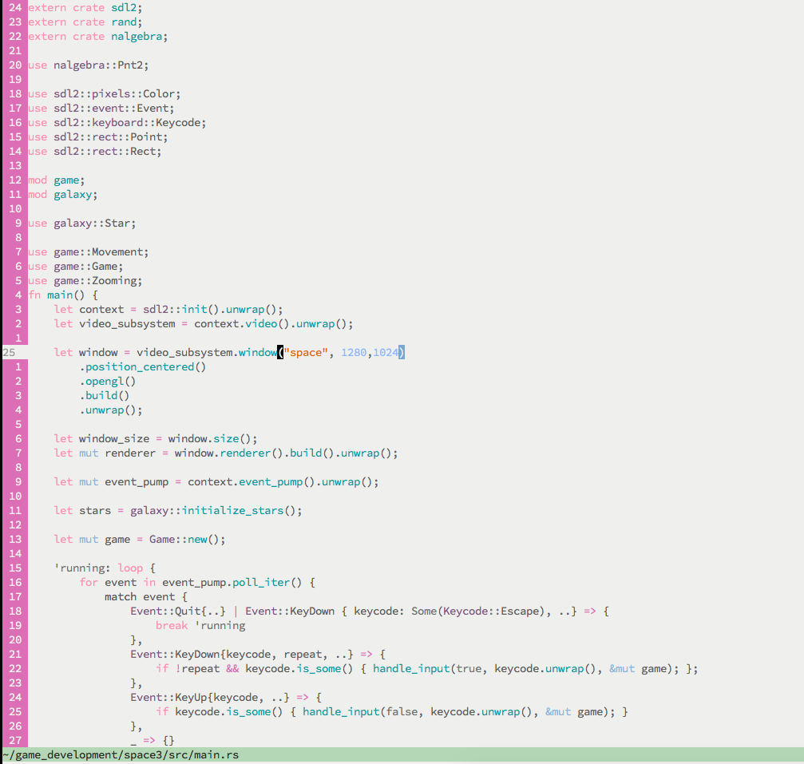
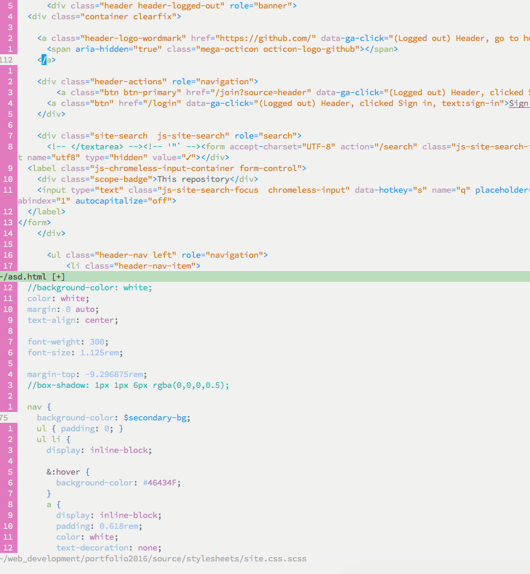

#Cake

*delicious delicious cake*

**Cake** is a light vim colorscheme.

##Installation

Use Vundle, Pathogen or whatever fancies your pantsies.

or stick it in ~/.vim/colors/cake.vim

##Config

Just make sure to be using `set background=light`, my cake is light only.
